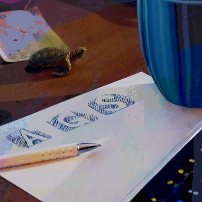

# Adventure Game Studio Help Files

## Editing the help files

[**Edit the Help in the Wiki**](https://github.com/adventuregamestudio/ags-manual/wiki) | [**Revision History**](https://github.com/adventuregamestudio/ags-manual/wiki/_history) | [](https://github.com/adventuregamestudio/ags-manual/actions)

The help files can be edited on the wiki or cloned locally and pushed. Please open an [issue](https://github.com/adventuregamestudio/ags-manual/issues) if something is wrong.

    git clone https://github.com/adventuregamestudio/ags-manual.wiki.git

## Reading the help files

The manual is hosted online on [adventuregamestudio.github.io/ags-manual/](https://adventuregamestudio.github.io/ags-manual/). You can also download the [latest release](https://github.com/adventuregamestudio/ags-manual/releases/latest).

## Contributing

Please check the guide in [`CONTRIBUTING.md`](CONTRIBUTING.md) for details.

[](https://adventuregamestudio.github.io/ags-manual/)

## Creating a release

Below are the steps necessary to creating a release using the automation currently in place (GitHub Actions).

### Approving links

If a link to a URL that is not a manual page is added in the GitHub wiki, this means any website links but also special URLs like `mailto:`, it needs to be approved or the build process will fail.

Approved links are alphabetically ordered in [`meta/approved_links.txt`](https://github.com/adventuregamestudio/ags-manual/blob/master/meta/approved_links.txt). Update it as needed.

### Generating a release

Just create a new tag in GitHub release interface with a name that begins with `v` (e.g. `v1.2.3`) and the GitHub Actions should trigger and generate the appropriate packages and push as assets in the Release page.

The CI from ags will then pick up the most recent version of the `ags-help.chm` uploaded to a release.

## Downloading pre-built release assets

Alongside the release package pre-built assets should be available for download:

- [CHM help file for Windows](https://github.com/adventuregamestudio/ags-manual/releases/latest/download/ags-help.chm)
- [Website archive](https://github.com/adventuregamestudio/ags-manual/releases/latest/download/website.zip)

## Building a release

Building a release requires a POSIX-like shell and build environment,
Pandoc, and optionally a CHM compiler.

Firstly download and extract the latest release archive:

```sh
# Download the release archive for version $VERSION to the current directory
url="https://github.com/adventuregamestudio/ags-manual/releases/download/v$VERSION/ags-manual-$VERSION.tar.gz"
curl -fLOJ "$url"

# Extract the archive to the current directory
tar -xvzf "ags-manual-$VERSION.tar.gz"

# Change into the new created directory
cd "ags-manual-$VERSION"
```

Next run the `configure` script. Help is available by running
`configure --help`.

The default behaviour is to build with Microsoft's CHM compiler `hhc`
which is found within an installation of "HTML Help Workshop", to
instead build with Free Pascal's `chmcmd` use the configure option
`--with-chmcmd`.

The default behaviour is to locate Pandoc and a CHM compiler by
searching in PATH and running feature tests as necessary. To bypass
the search and feature checks the following environment variables can
be set:

variable | defines
--- | ---
PANDOC | path to pandoc
CHMCMD | path to chmcmd
HHC | path to hhc

```sh
# configure build with default settings
./configure
```

Once configuration is complete the build can be started by running
`make`.

```sh
make -j $(($(getconf _NPROCESSORS_ONLN) - 1))
```

The resulting files can be installed with `make install` but the
installation can be staged into a custom directory to achieve the
final file and directory structure.

```sh
make DESTDIR=destdir install
```

## License

Source code in this repository is distributed under MIT license. See [`LICENSE`](LICENSE) for more information. Manual content follows [Adventure Game Studio's license](https://github.com/adventuregamestudio/ags/blob/master/License.txt).
