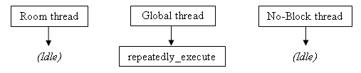
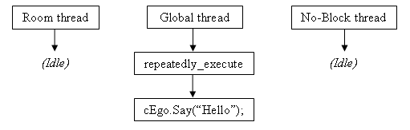

 

------------------------------------------------------------------------

Understanding blocking scripts
------------------------------

You will see some commands listed as "blocking", where control does not
return to the script until the command finishes. But what does this
mean, exactly?

In order to better understand this, we need to explore a little about
the way that the AGS script engine works. In an AGS game, there are
three script **threads** that can be running at once. Think of a thread
as a mini-CPU that executes your scripts.

At the start of the game, the threads are all idle (not running any
scripts):

Now, as and when your scripts need to be run, AGS will try to run them
on the appropriate thread (the Room thread for local scripts, and the
Global thread for global scripts).

So, on the first game loop, your global scripts' repeatedly\_execute
will be run:

That's fine, and when it finishes running the thread becomes idle again.

But, suppose that within repeatedly\_execute, you make a call to the
Character.Say command. Say (or *DisplaySpeech* in old-style scripting)
is a blocking command and does not return until the character finishes
talking:

The global thread is now **blocked**, waiting for the character to
finish talking. This means that none of your global script functions
such as repeatedly\_execute, on\_event and on\_key\_press will be run
while the character is talking, since the thread is busy.

Now, AGS does queue up to 5 script functions to be run on the thread as
soon as it is free; but if you have a lot of things happening within
your script, it's possible that you will lose some events such as
on\_events and keypresses if you script is blocked for a long time.

Let's explore the most common situation in which this causes confusion.
Suppose you have a *Player looks at inventory* event on a Key inventory
item, which runs a script to display a message.

Let's also suppose that you have some code at the end of your
on\_mouse\_click function to make the character stand still after
running mouse click events.

What you'll find is that the code at the end of on\_mouse\_click
actually gets called *before* the inventory item's event. Let's look at
why:

Remember that AGS does not run events automatically; rather, the
on\_mouse\_click script function handles the mouse click and calls
ProcessClick to run the appropriate event. When it does so, it finds
that the key's Look At Item event has a script function associated with
it.

But oh no! Inventory item scripts are in the global script, and the
global thread is already blocked because of the mouse click. Therefore,
the inventory event script gets added to the thread's queue, and
on\_mouse\_click then finishes running. The inventory event script will
follow on afterwards.

Now you might think that this means that object and hotspot events can
run within on\_mouse\_click, since they use the room thread, like this:

However, this is not the case. It is still the global thread that is
calling ProcessClick, so the room script will actually be run on the
global thread once it is free.

Finally, we come onto the No-Block thread. This thread is only used to
run the *repeatedly\_execute\_always* and
*late\_repeatedly\_execute\_always* functions. Because these two are not
allowed to run any blocking functions, this ensures that the thread
never gets blocked and so it will always run, even when the other
threads are busy:

I hope that helps explain blocking in terms of AGS scripting. If there's
anything that you don't think is clear, please suggest amendments on the
Technical forum.
